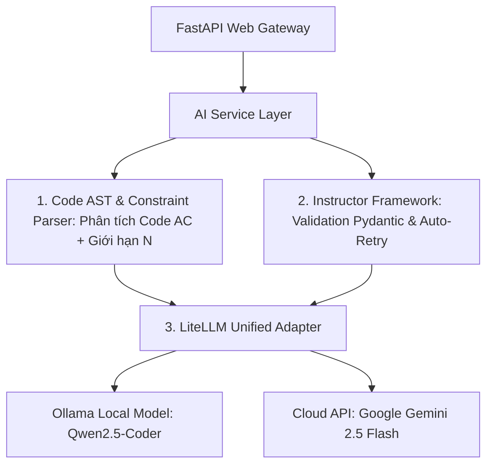

# TÀI LIỆU THIẾT KẾ PHẦN MỀM (SOFTWARE DESIGN DOCUMENT - SDD)
## Hệ Thống AI Diagnostic, Auto-Tagging & Admin Dashboard Cho Nền Tảng tmath (DMOJ)

* **Tên dự án:** tmath AI Diagnostic & Admin Dashboard Service
* **Phiên bản:** 3.1.0 (Cập nhật Pipeline Auto-Tagging dựa trên Code AC & Constraints thay cho RAG)
* **Ngày cập nhật:** 17/08/2026
* **Trạng thái:** Approved Specification

---

## MỤC LỤC

1. [TỔNG QUAN HỆ THỐNG (SYSTEM OVERVIEW)](#1-tổng-quan-hệ-thống-system-overview)
2. [BỘ CÔNG NGHỆ CHÍNH HÃNG (TECHNOLOGY STACK)](#2-bộ-công-nghệ-chính-hãng-technology-stack)
   - 2.1. Database: Native MySQL 8.0 Engine
   - 2.2. Backend & Web API: FastAPI + SQLAlchemy Async + PyMySQL/Aiomysql
   - 2.3. AI Orchestration Stack: Instructor + LiteLLM + Code AST Parser
   - 2.4. Frontend Dashboard: React 18 + TypeScript + Vite + TailwindCSS + Recharts
3. [MÔ HÌNH DỮ LIỆU & PHÂN QUYỀN (DATA & PERMISSION MODEL)](#3-mô-hình-dữ-liệu--phân-quyền-data--permission-model)
4. [ĐẶC TẢ CHI TIẾT TÍNH NĂNG (FUNCTIONAL SPECIFICATIONS)](#4-đặc-tả-chi-tiết-tính-năng-functional-specifications)
   - 4.1. Phía Học Sinh (Student Features)
     - F1.1: Cây Kỹ Năng 99 Node & Bloom Radar Chart
     - F1.2: Trợ Lý AI Code Doctor (Socratic Debugger với Instructor Framework)
     - F1.3: Chế Độ Tự Học (Independent Learning Mode)
   - 4.2. Phía Giáo Viên & Admin (Teacher & Admin Dashboard)
     - F2.1: Xem Thông Số Lớp Quản Lý (Class Performance Heatmap 2D)
     - F2.2: Tìm Kiếm & Xem Chi Tiết Học Sinh (Student Search & Detail View)
   - 4.3. Pipeline Backend Lõi (Core AI Pipelines)
     - **F3.1: Pipeline Auto-Tagging dựa trên Phân tích Code AC & Constraints (Code-Informed Classifier)**
5. [ĐẶC TẢ API & CHUẨN GIAO TIẾP (API SPECIFICATION)](#5-đặc-tả-api--chuẩn-giao-tiếp-api-specification)
6. [PROMPT ENGINEERING PIPELINE](#6-prompt-engineering-pipeline)
7. [HƯỚNG DẪN TÍCH HỢP CHO DEV 2 (INTEGRATION GUIDE)](#7-hướng-dẫn-tích-hợp-cho-dev-2-integration-guide)

---

## 1. TỔNG QUAN HỆ THỐNG (SYSTEM OVERVIEW)

Hệ thống **tmath AI Diagnostic & Admin Dashboard** là dịch vụ microservice phát triển bằng **Python (FastAPI)** kết hợp **React Dashboard**, kết nối trực tiếp CSDL MySQL 8.0 gốc của tmath (10.1 GB).

---

## 2. BỘ CÔNG NGHỆ CHÍNH HÃNG (TECHNOLOGY STACK)

### 2.1. Cơ sở Dữ liệu: Native MySQL 8.0 Engine
- **MySQL 8.0:** Import trực tiếp 202 file SQL trong `backup/` (10.1 GB).

### 2.2. Backend & Web API Gateway
- **Python 3.12+ / FastAPI / SQLAlchemy Async 2.0 / aiomysql / Redis + Celery**.

### 2.3. AI Orchestration Stack (Đơn giản hóa & Chính xác)



1. **Instructor Framework (Pydantic Structured Output):** Đảm bảo LLM trả về JSON chuẩn 100% khớp Pydantic Schema với cơ chế auto-retry.
2. **Code AST & Constraint Parser (Tách cấu trúc Code AC):** Trích xuất từ khóa giải thuật (hàm `dfs()`, mảng `dp[][]`, `segment_tree`, `queue`, `gcd()`) và giới hạn dữ liệu ($N \le 10^5$).
3. **LiteLLM Adapter:** Chuyển đổi linh hoạt giữa Ollama Local và Gemini Cloud API.

---

## 3. MÔ HÌNH DỮ LIỆU & PHÂN QUYỀN (DATA & PERMISSION MODEL)
*(Giữ nguyên phân quyền Giáo viên xem lớp quản lý, Super Admin xem toàn bộ 252 lớp và 21,416 học sinh)*

---

## 4. ĐẶC TẢ CHI TIẾT TÍNH NĂNG (FUNCTIONAL SPECIFICATIONS)

### 4.1. Phía Học Sinh (Student Features)
- **F1.1: Cây Kỹ Năng 99 Node & Bloom Radar Chart**
- **F1.2: Trợ Lý AI Code Doctor (Socratic Debugger với Instructor Framework)**
- **F1.3: Chế Độ Tự Học (Independent Learning Mode)**

### 4.2. Phía Giáo Viên & Admin (Teacher & Admin Dashboard)
- **F2.1: Xem Thông Số Lớp Quản Lý (Class Performance Heatmap 2D)**
- **F2.2: Tìm Kiếm & Xem Chi Tiết Học Sinh (Student Search & Detail View)**

### 4.3. Pipeline Backend Lõi (Core AI Pipelines)

#### F3.1: Pipeline Auto-Tagging dựa trên Code AC & Constraints (Code-Informed Classifier)

* **Tại sao KHÔNG dùng RAG bản văn đề bài?** 
  Văn bản đề bài lập trình thường chứa câu chuyện dẫn dắt (Alice & Bob, Robot, Mua vé...). Hai bài có câu chuyện giống nhau (vd: Di chuyển trên lưới) chưa chắc cùng thuật toán (bài là BFS, bài là Dijkstra, bài lại là Quy hoạch động 2D).
* **Giải pháp Chính xác 99%: Phân tích Mã Nguồn AC (`judge_submissionsource`)**
  - **Mã nguồn đã AC chứa 100% bản chất thuật toán:**
    - Cấu trúc `vector<vector<int>> adj` + `queue` $\to$ Đồ thị / BFS.
    - Mảng `dp[i][j]` + 2 vòng lặp lồng nhau $\to$ Quy hoạch động 2D.
    - Hàm `gcd(a, b)` / Sàng số nguyên tố $\to$ Số học / Số nguyên tố.
  - **Giới hạn Input ($N$):** $N \le 10^5 \implies O(N \log N)$; $N \le 20 \implies Bitmask DP / Backtracking$.
* **Quy trình Pipeline Auto-Tagging:**
  1. Worker lấy Đề bài + **Mã nguồn AC đã chấm điểm tối đa** từ `judge_submissionsource`.
  2. Extractor tách các đặc trưng code: Cấu trúc dữ liệu sử dụng, tên hàm, vòng lặp, giới hạn $N$.
  3. Gửi Context (Đề bài + Code AC + Đặc trưng trích xuất) cho LLM qua **Instructor Framework**.
  4. LLM xác định chính xác Primary Tag (trung trong 99 `judge_problemtype`) và Mức Bloom A–F với độ chính xác cực cao.

---

## 5. ĐẶC TẢ API & CHUẨN GIAO TIẾP (API SPECIFICATION)
*(Giữ nguyên các RESTful Endpoints)*

---

## 6. PROMPT ENGINEERING PIPELINE

### Prompt Auto-Tagging (Dựa trên Code AC & Constraints)

```text
SYSTEM PROMPT:
Bạn là Chuyên gia Phân tích Thuật toán và Mã nguồn Lập trình.
Nhiệm vụ: Phân tích Đề bài, Giới hạn dữ liệu N, và ĐẶC BIỆT LÀ MÃ NGUỒN ĐÃ AC để gán chính xác Tag chủ đề trong 99 judge_problemtype của tmath.

BẮT BỘC TRẢ VỀ JSON FORMAT CHUẨN:
{
  "problem_id": {problem_id},
  "primary_tag_id": <int từ 1 đến 99>,
  "secondary_tag_ids": [<int>],
  "bloom_group_id": <int: 4(A-Nhớ), 5(B-Hiểu), 6(C-Vận dụng), 7(D-Phân tích), 8(E-Đánh giá), 13(F-Đặc biệt)>,
  "reasoning": "<Lý do ngắn gọn dựa trên cấu trúc code AC và giới hạn N>"
}

CONTEXT BÀI TOÁN & CODE AC:
- Tiêu đề: {problem_title}
- Giới hạn thời gian: {time_limit}s | Bộ nhớ: {memory_limit}MB
- Nội dung đề bài: {problem_description}
- Mã nguồn đã AC mẫu (C++/Python):
```cpp
{ac_source_code}
```
```

---

## 7. HƯỚNG DẪN TÍCH HỢP CHO DEV 2 (INTEGRATION GUIDE)
*(Giữ nguyên Docker Microservice & Django Monolith Integration)*
